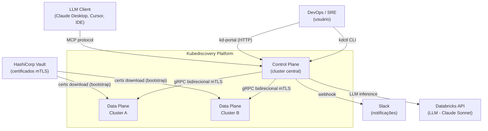
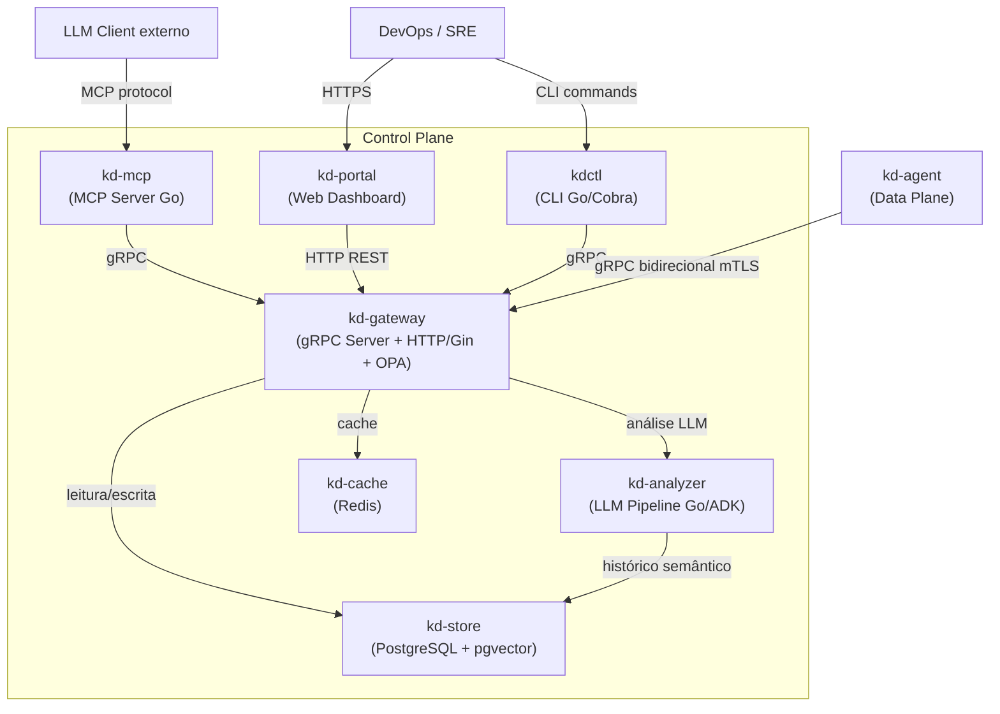
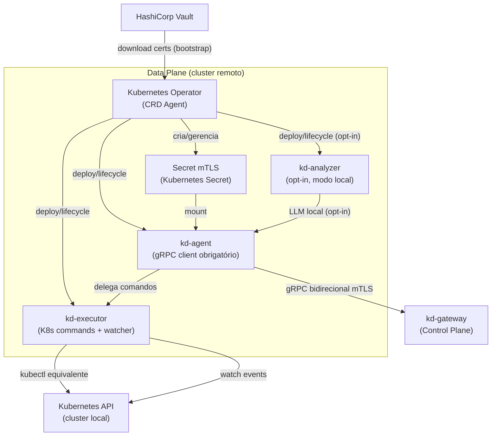
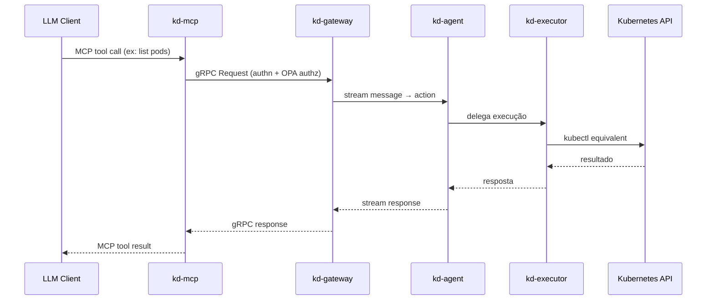
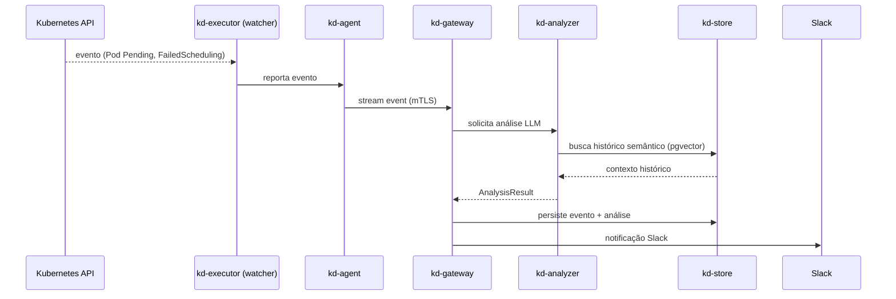

## Context

O Kubediscovery é uma plataforma nova, sem código legado a migrar (exceto `services/validate/` que permanece como protótipo de referência). A arquitetura parte do zero com um monorepo Go multi-módulo conectado via `go.work`.

O principal desafio de design é a comunicação segura e resiliente entre o Control Plane (hospedado num cluster central) e N clusters remotos (Data Plane), onde cada cluster remoto pode estar em redes privadas sem IP público exposto. A solução é o `kd-agent` iniciando a conexão gRPC bidirecional de saída (outbound), invertendo o modelo cliente-servidor tradicional.

**Stakeholders:** equipes DevOps/SRE que operam múltiplos clusters Kubernetes.
**Constraints:** mTLS obrigatório em toda comunicação Control Plane ↔ Data Plane; zero dependência de IP público nos clusters remotos; LLM executa no Control Plane por default.

---

## Goals / Non-Goals

**Goals:**
- Definir a arquitetura de componentes e seus limites de responsabilidade
- Estabelecer os padrões de comunicação (gRPC bidirecional, mTLS, retry)
- Documentar o modelo de dados central (PostgreSQL + pgvector + Redis)
- Definir o padrão interno de cada serviço (UberFX, Viper, Cobra, Gin, observabilidade)
- Mapear os fluxos críticos: registro de agente, execução remota, detecção de problemas, request via MCP

**Non-Goals:**
- Implementação detalhada de políticas Rego (OPA) — pertence à spec `opa-authz`
- Schema de banco de dados (migrations) — pertence às specs individuais de cada serviço
- Design do frontend `kd-portal` — pertence à spec `kd-portal`
- Configuração de infraestrutura (Helm, Terraform) — fora do escopo desta fase

---

## Decisions

### D1 — Comunicação via gRPC bidirecional iniciada pelo Data Plane

**Decisão:** O `kd-agent` (Data Plane) inicia a conexão gRPC de saída para o `kd-gateway` (Control Plane), estabelecendo um stream bidirecional persistente.

**Rationale:** Clusters remotos frequentemente estão em redes privadas sem IP público. Exigir que o Control Plane inicie conexões para os agentes tornaria o deployment complexo (VPNs, firewall rules, IPs estáticos). Com o agente iniciando a conexão, apenas o gateway precisa de endpoint público.

**Alternativa considerada:** Service mesh (Istio/Linkerd) com mTLS gerenciado — rejeitado por adicionar complexidade operacional e dependência de infraestrutura específica.

---

### D2 — Monorepo com `go.work` + módulos Go independentes

**Decisão:** Monorepo único com `go.work` na raiz conectando todos os módulos durante o desenvolvimento. Cada serviço tem seu próprio `go.mod` para publicação independente.

**Rationale:** `go.work` é o mecanismo oficial do Go para workspaces multi-módulo. Elimina `replace` directives nos `go.mod`, funciona nativamente com `go build/test` e gopls. `go.work` não é commitado em CI/CD — cada serviço publica e versiona independentemente.

**Alternativa considerada:** Único `go.mod` na raiz — rejeitado por acoplar todos os serviços num único ciclo de release e dificultar deploys independentes.

---

### D3 — UberFX como framework de DI em todos os serviços

**Decisão:** Todos os serviços Go usam `go.uber.org/fx` para dependency injection e lifecycle management.

**Rationale:** UberFX provê lifecycle hooks (`OnStart`/`OnStop`) para graceful shutdown, wiring declarativo de dependências e suporte a módulos (`fx.Module`) que mapeiam diretamente para a estrutura de domínios. Consistência entre serviços reduz curva de aprendizado.

**Alternativa considerada:** Wire (Google) — rejeitado por ser geração de código em tempo de compilação, menos flexível para módulos dinâmicos.

---

### D4 — OPA embutido como biblioteca Go no `kd-gateway`

**Decisão:** `github.com/open-policy-agent/opa/rego` embutido no `kd-gateway` como interceptor gRPC. Políticas Rego carregadas de arquivos ou do `kd-store`.

**Rationale:** Cada chamada gRPC precisa de avaliação de política — latência de rede para um OPA externo seria inaceitável no hot path. Embutido, a avaliação é in-process (microsegundos). OPA externo pode ser introduzido em fases posteriores para gestão centralizada de políticas multi-instância.

**Alternativa considerada:** OPA como sidecar — rejeitado por adicionar latência de rede e complexidade de deploy no MVP.

---

### D5 — PostgreSQL + pgvector para estado e memória LLM

**Decisão:** `kd-store` usa PostgreSQL com extensão `pgvector` para persistência estruturada (clusters, eventos, configs) e busca semântica (memória LLM indexada por `clusterName+Environment+Namespace`).

**Rationale:** Mantém infraestrutura mínima (um banco para dois casos de uso), pgvector suporta similarity search adequadamente para o volume inicial. Redis complementa como cache e estado efêmero.

**Alternativa considerada:** Qdrant/Weaviate para vector store dedicado — rejeitado para o MVP por adicionar um componente de infraestrutura extra. Pode ser introduzido se escala ou qualidade de retrieval exigir.

---

### D6 — `kd-mcp` como componente dedicado

**Decisão:** Servidor MCP separado (`kd-mcp`) que traduz o protocolo MCP para gRPC e se conecta ao `kd-gateway`.

**Rationale:** Mantém o `kd-gateway` focado em orquestração interna. O protocolo MCP evolui independentemente (novos clientes LLM, versões do protocolo) sem impactar o core do gateway. Permite escalar `kd-mcp` independentemente do gateway.

**Alternativa considerada:** MCP embutido no `kd-gateway` — rejeitado por misturar responsabilidades e acoplar o protocolo externo ao core interno.

---

### D7 — Certificados via HashiCorp Vault + Kubernetes Secrets

**Decisão:** `kdctl` gera certificados mTLS localmente. O usuário publica no HashiCorp Vault. O Kubernetes Operator faz o download do Vault no bootstrap e cria Kubernetes Secrets no cluster remoto. Os componentes do Data Plane montam os Secrets.

**Rationale:** Vault é o padrão de mercado para gestão de secrets em ambientes Kubernetes. Delegar o upload ao usuário mantém o controle de acesso ao Vault fora do escopo da plataforma (cada organização tem sua política de Vault).

**Alternativa considerada:** `kdctl` fazendo push direto via kubeconfig — rejeitado por não escalar para ambientes com restrições de acesso direto ao cluster remoto.

---

## C4 Diagrams

### Level 1 — System Context

**Boundaries:** O Control Plane é o único componente com endpoint público. Os clusters remotos (Data Plane) iniciam conexões de saída — sem necessidade de IP público ou firewall inbound.

**Assumptions:** Databricks API acessível a partir do Control Plane. HashiCorp Vault acessível pelos clusters remotos no bootstrap.

---

### Level 2 — Container (Control Plane)

---

### Level 2 — Container (Data Plane)

---

### Level 3 — Dynamic: Fluxo de Request do Usuário (via MCP)

---

### Level 3 — Dynamic: Fluxo de Detecção de Problemas

---

## Risks / Trade-offs

| Risco | Mitigação |
|---|---|
| Stream gRPC bidirecional pode cair (rede instável) | `kd-agent` implementa retry com backoff exponencial (1s, 3s, 9s, 27s, 81s → fatal). Gateway detecta desconexão via heartbeat. |
| OPA embutido aumenta footprint de memória do gateway | Políticas Rego compiladas em cache na inicialização. Monitorar via Prometheus. Migrar para OPA sidecar se necessário. |
| pgvector pode não escalar para grandes volumes de embeddings | Aceitável no MVP. Migração para Qdrant/Weaviate é isolada no `kd-store` sem impacto nos outros serviços. |
| HashiCorp Vault como dependência de bootstrap | Se Vault estiver indisponível, novos agentes não conseguem bootstrapar. Mitigação: Secrets já criados persistem no cluster — apenas novos deployments são afetados. |
| Monorepo com `go.work` pode causar confusão em CI/CD | `go.work` não é commitado. Cada serviço tem seu próprio pipeline de CI com `go.mod` independente. Documentar claramente no README. |
| `kd-mcp` como ponto único de falha para clientes LLM | Stateless por design — múltiplas réplicas via Kubernetes HPA. |

---

## Migration Plan

Projeto novo — sem migração de sistema legado.

**Ordem de deploy para o MVP (Phase 1):**
1. `kd-store` (PostgreSQL + Redis) — infraestrutura de dados
2. `kd-gateway` — ponto focal, depende do store
3. `kd-agent` + `kd-executor` nos clusters remotos (certs via Vault ou manual no MVP)
4. `kdctl` — validação end-to-end do fluxo de registro e execução

**Rollback:** cada componente é stateless (exceto `kd-store`). Rollback = redeploy da versão anterior da imagem Docker. `kd-store` usa golang-migrate com migrations versionadas e reversíveis.

---

## Open Questions

1. **Autenticação de usuários no `kd-gateway`:** O design atual cobre autenticação de agentes (mTLS). Autenticação de usuários humanos (kdctl, portal) ainda não está definida — JWT? OIDC? A ser resolvido na spec `kd-gateway-core`.

2. **Multi-tenancy:** O design assume uma única organização. Se múltiplos times/tenants precisarem de isolamento, o modelo de dados e as políticas OPA precisarão de revisão. A ser avaliado após o MVP.

3. **Versioning do protocolo gRPC:** Com múltiplos agentes em versões diferentes conectados ao mesmo gateway, como gerenciar compatibilidade de proto? Definir política de versioning no `proto/` antes da Phase 2.

4. **Rate limiting no `kd-gateway`:** Não definido ainda. Necessário antes de expor o endpoint público. A ser incluído na spec `kd-gateway-core`.
